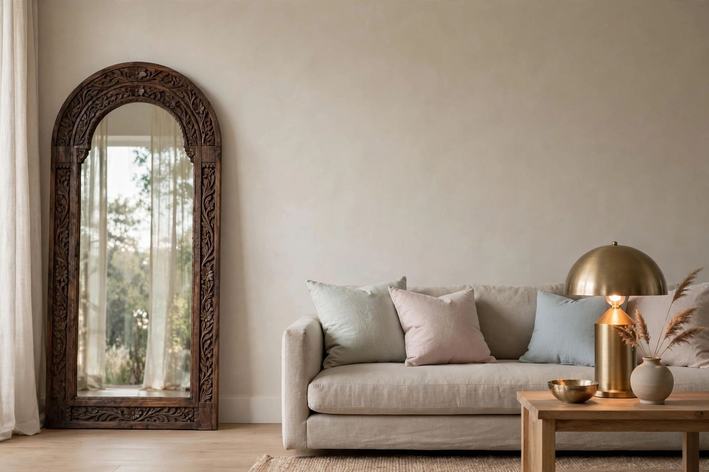
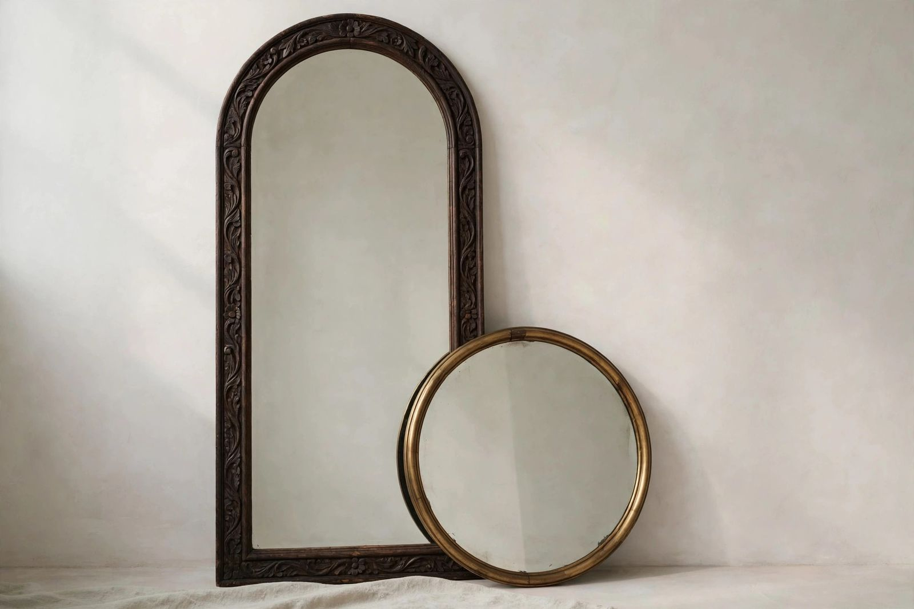
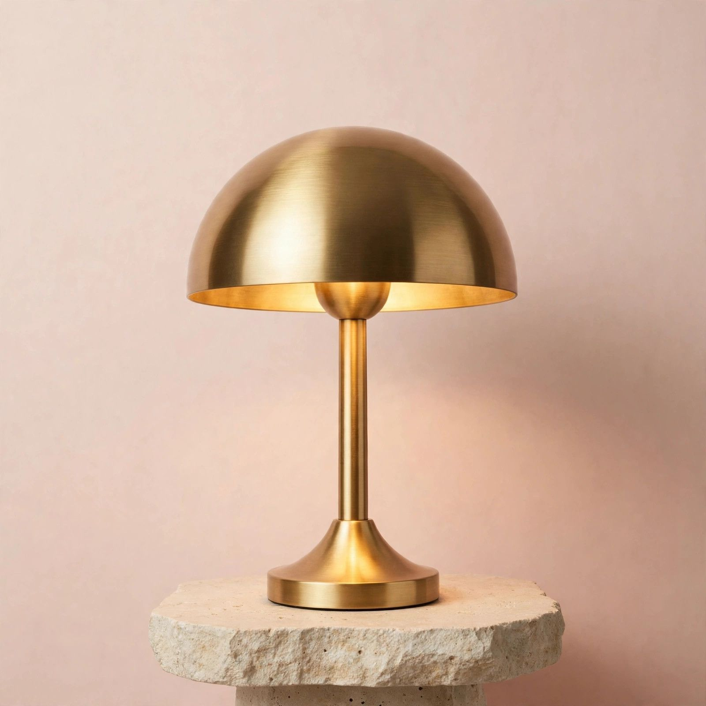
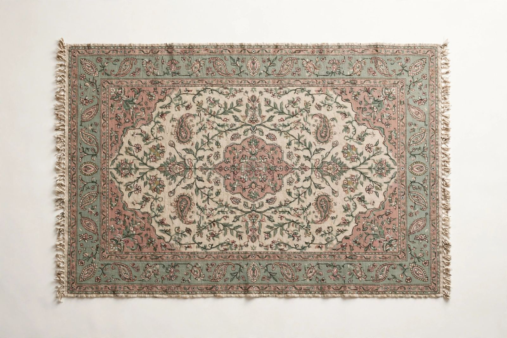

# Pitriciacle — Luxury Home Decor Shopify Theme

> **A $500-calibre theme, free and open source.** Quiet luxury for stores that sell
> beautiful objects — hand-carved mirrors, brass and copper, woven rugs, sculptural light.

Built for a real luxury home-decor brand (INR ₹3,500–₹35,000 price band, Indian artisans,
HNI + international clientele) — then released free so any merchant can have a storefront
that feels like a flagship.

---

## Preview

| | |
|---|---|
|  |  |
| *Cinematic hero: full-viewport, slow Ken Burns drift, staggered serif reveals* | *Collection tiles in the muted-pastel system* |
|  |  |
| *Product imagery ships as elegant AI placeholders — swap with real photography* | *Cards: hover image-swap, quick-add, quick-view* |

*Imagery above is the theme's bundled placeholder set (original, zero IP risk).
Live storefront screenshots will be added after launch.*

---

## Why Pitriciacle?

Most free themes make you look like everyone else. Most premium themes charge
$350+ and still need five paid apps to feel luxurious. Pitriciacle was designed
backwards from the feeling of walking into a beautiful store: restraint, light,
and room to breathe — with the commerce machinery of a flagship humming underneath.

**The aesthetic:** Zara-level restraint with a whisper more colour. Porcelain,
sand, sage mist, dusty blush — champagne used like jewellery, never like paint.
Cormorant Garamond display serif over Jost. Hairlines, whitespace, and
letter-spaced micro-labels instead of noise.

---

## Features

### Design & experience
- **Cinematic hero** — full-viewport, 14s Ken Burns drift, line-by-line staggered
  headline reveals, `*italic*` champagne accents, animated scroll cue
- **Transparent overlay header** that frosts into porcelain on scroll
- **Immersive sections** — brand manifesto, editorial marquee, parallax quote banners,
  shoppable lookbook with pulsing product hotspots, atelier stats, heritage timeline
- **Motion system** — staggered reveals, rAF parallax, CSS marquee, all
  `prefers-reduced-motion` safe, zero libraries
- **40 sections**, every one with presets, colour-scheme control
  (Porcelain / Sand / Sage / Blush / Ink) and spacing controls

### Commerce (no apps required)
- **Wishlist** — hearts on cards + product page, saved-list drawer, header count badge
- **Back-in-stock alerts** — elegant notify-me forms on sold-out pieces
- **Made-to-order mode** — tag a product, the button becomes "Pre-order" with your lead-time note
- **Stylist concierge** — "Speak to our stylist" auto-appears on high-ticket pieces (₹20k+ threshold)
- **Gifting suite** — gift-wrap toggle + handwritten message in the cart drawer (festive-ready)
- **Complete the room** — bundle builder with live combined total
- **Trade program** — dedicated B2B page + enquiry form (studio, GSTIN, volumes)
- Predictive search, faceted collection filtering + mobile drawer, quick-view modal,
  quick-add, sticky add-to-cart, cart upsells, gift notes, recently viewed,
  trust badges, white-glove delivery banners, Markets currency selector

### Performance & accessibility
- Deferred vanilla JS (~700 lines, zero `console.*`), preconnected fonts,
  lazy below-fold imagery, zero layout shift by construction
- Skip links, focus traps, Esc-closes-everything, keyboard-operable hotspots,
  visible focus rings, contrast-audited palette
- JSON-LD Product structured data for SEO

### Merchant-ready
- 12-product demo catalog as import-ready CSV (`docs/products/`)
- 6 product metafields documented (material, dimensions, care, artisan note…)
- Setup guides for collections, metafields, gifting, trade page, image swaps

---

## Pitriciacle vs. the others

| | **Pitriciacle** | Dawn | Impulse | Prestige |
|---|---|---|---|---|
| Price | **Free (MIT)** | Free | $380 | $350 |
| Built for luxury specifically | ✅ | — | ✅ | ✅ |
| Sections | 40 | ~30 | 30+ | 25+ |
| Predictive search | ✅ | ✅ | ✅ | ✅ |
| Faceted filtering | ✅ | ✅ | ✅ | ✅ |
| Wishlist (built-in) | ✅ | — | — | — |
| Back-in-stock alerts | ✅ | — | — | ✅ |
| Gifting suite | ✅ | — | — | — |
| Made-to-order mode | ✅ | — | — | — |
| Stylist concierge | ✅ | — | — | — |
| Trade/B2B page | ✅ | — | — | — |
| Shoppable lookbook hotspots | ✅ | — | ✅ | — |
| Official support | Community | ✅ Shopify | ✅ Maestrooo | ✅ Maestrooo |
| Battle-tested at scale | Newer | ✅✅ | ✅✅ | ✅✅ |

*Comparison as of October 2026, based on public feature lists.*

---

## Honest pros & cons

**Pros**
- Free forever, MIT licensed — use it on unlimited stores, modify anything
- A genuine luxury aesthetic out of the box, not a generic theme with a serif font
- Luxury-commerce features (wishlist, gifting, concierge, trade) that paid themes
  don't include — and that would otherwise cost $20–60/month in apps
- INR-ready, artisan-brand storytelling baked in (Craft / Heritage pages)
- Clean, modern codebase: OS 2.0 JSON templates, vanilla JS, no jQuery

**Cons**
- **No official support** — help comes from GitHub issues and community, not a support desk
- **Newer codebase** — less battle-tested than Dawn/Impulse/Prestige at massive scale
- **Placeholder imagery** — beautiful, but you must shoot or source real photography
- **Some setup required** — gift-wrap product, metafields, tags and thresholds are
  documented but manual (see `docs/`)
- **English only** — full `en.default` locale (243 keys), but no translations shipped yet

## Is it worth it?

If you're launching a premium home/lifestyle/fashion brand and the alternative is
$350 for a theme plus $40/month in wishlist/gift apps — yes, by a wide margin.
If you need a support SLA and a decade of edge cases ironed out, buy Impulse and
sleep well. Pitriciacle is for founders who'd rather spend that money on product
photography.

---

## Installation

**You need:** a Shopify store (any plan).

1. Download **`pitriciacle-theme.zip`** from this repo (root, or the latest Release).
2. Shopify admin → **Online Store → Themes → Add theme → Upload zip file**.
3. **Customize** — the homepage ships fully composed; tweak sections, colours and copy.
4. *(Optional)* Import the demo catalog: **Products → Import** →
   `docs/products/pitriciacle-products.csv`, then create the 4 automated collections
   per `docs/COLLECTIONS-SETUP.md`.
5. Swap placeholder imagery for real photography (`docs/IMAGES.md` lists every file).

Full guides in [`docs/`](docs/): `THEME-SETUP.md` · `METAFIELDS.md` ·
`COLLECTIONS-SETUP.md` · `IMAGES.md`

---

## Tech notes

- Online Store 2.0 · JSON templates · section groups where it matters
- Vanilla JS (deferred), hand-written CSS, Google Fonts (Cormorant Garamond + Jost)
- 243-key `en.default` locale, zero missing keys (CI-verified at release)
- AI-generated placeholder imagery — original, no stock licensing issues

## Contributing

Issues and pull requests welcome. Please keep the aesthetic bar high: restraint,
light, and room to breathe.

## License

MIT © Sunny Gupta — see [LICENSE](LICENSE). Use it anywhere, including commercial stores.
